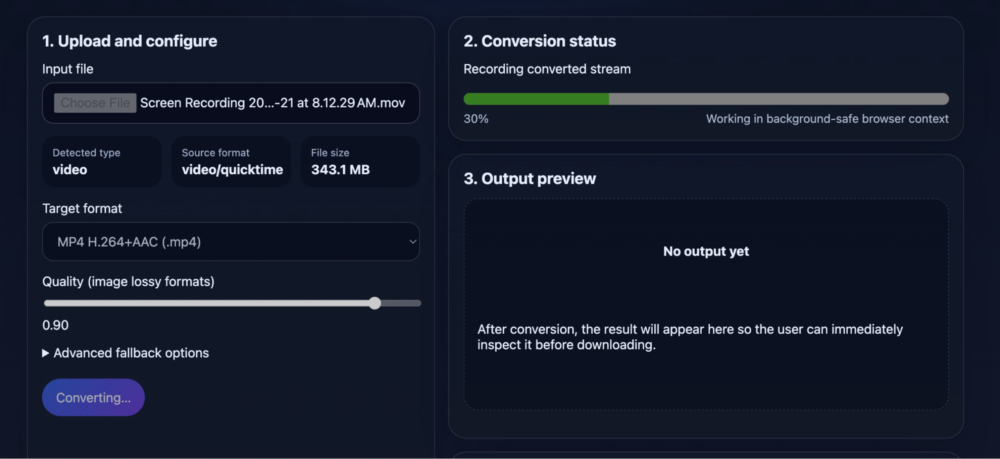

# LocalMorph

A React + TypeScript + Vite client-side file converter for GitHub Pages.



## Stack

- React 19
- TypeScript
- Vite
- Native browser conversion paths only

## Features

- Dedicated landing page that explains privacy, performance, and the conversion flow
- Separate converter workspace focused on upload, route clarity, status, and preview
- Built-in Privacy Policy and Terms of Use pages for static deployments
- Image conversion via Canvas export
- Audio/video conversion via `MediaRecorder` when supported by the browser
- GitHub Pages deployment workflow

## Local development

```bash
npm install
npm run dev
```

## Production build

```bash
npm run build
```

## Deployment

Push to `main` and GitHub Actions will build and publish `dist/` to GitHub Pages.

### Custom domain

This repo now includes `public/CNAME`, so each production build publishes the custom domain
`localmorph.com` with the site artifact.

To finish the setup in GitHub Pages:

1. Open the repository `Settings` → `Pages`.
2. Set the custom domain to `localmorph.com`.
3. Enable `Enforce HTTPS` after DNS finishes propagating.

DNS should point the domain at GitHub Pages:

- For the apex domain `localmorph.com`, use GitHub Pages-supported `A`/`AAAA` records or an
  `ALIAS`/`ANAME` record if your DNS provider supports it.
- For `www.localmorph.com`, add a `CNAME` to your GitHub Pages host and optionally redirect
  `www` to the apex domain.

## Branding and legal pages

The app is branded as `LocalMorph` and includes hash-routed `Privacy Policy` and `Terms of Use`
pages so they work on static hosting without additional server routes.

## Manual smoke checklist

1. Run `npm run dev` and verify the app loads.
2. Convert PNG/JPEG/WebP image through the native route.
3. Convert a small audio/video file where `MediaRecorder` support is reported.
4. Try an unsupported output and confirm the app reports it as unsupported.
5. Run the deployed site in Chromium, Firefox, and Safari.

## Known constraints

- MediaRecorder-based audio/video conversion remains browser-dependent.
- Native encoding support varies by browser and installed codecs.
- Trim controls are unavailable in native-only mode.
- The included privacy and terms copy is product-facing starter content and should be reviewed
  before production/legal use.
