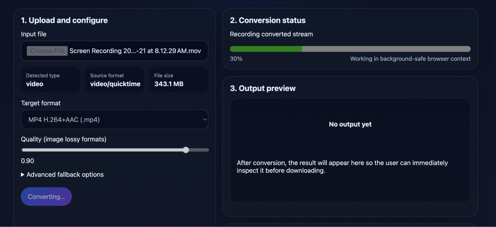

# LocalMorph

A React + TypeScript + Vite client-side file converter for GitHub Pages.



## Stack

- React 19
- TypeScript
- Vite
- Browser-native conversion paths with an optional local FFmpeg bridge

## Features

- Dedicated landing page that explains privacy, performance, and the conversion flow
- Separate converter workspace focused on upload, route clarity, status, and preview
- Built-in Privacy Policy and Terms of Use pages for static deployments
- Image conversion via Canvas export
- Audio/video conversion via `MediaRecorder` when supported by the browser
- Optional LocalMorph Bridge integration for FFmpeg conversion on the same device
- GitHub Pages deployment workflow

## Local development

```bash
npm install
npm run dev
```

## Production build

```bash
npm run build
```

## Optional LocalMorph Bridge

For conversions that need FFmpeg, install the
[.NET 10 SDK](https://dotnet.microsoft.com/download/dotnet/10.0) and FFmpeg
separately, then run the lightweight LocalMorph Bridge on the same Windows,
macOS, or Linux device. On Windows, the SDK is also available through Winget:

```powershell
winget install --id Microsoft.DotNet.SDK.10 -e
```

Verify `dotnet --version` reports 10.x before starting the bridge:

```bash
dnx LocalMorph.Bridge
```

Alternatively, install it permanently with:

```bash
dotnet tool install --global LocalMorph.Bridge
localmorph-bridge
```

The website can copy the command with one click. Browsers cannot execute local
terminal commands directly, including through Windows Terminal, without a
separately installed protocol handler. Paste the copied command into your
terminal, then copy the complete `LOCALMORPH_BRIDGE={...}` startup line and
paste it once into the converter settings. LocalMorph validates the loopback
URL and fills in both connection values. The bridge package does not
redistribute FFmpeg.

## LocalMorph Desktop (.NET MAUI)

`dotnet/src/LocalMorph.App` is a native desktop app for Windows and macOS that converts
**any number of files at once** with the tools already on your device — no browser limits.

- **Batch queue** — add files or whole folders, drag & drop, or pass paths on the command line
  (`LocalMorph.App.exe video.mov photo.heic`). Files convert in parallel with live progress,
  speed, and ETA; cancel any job or all of them.
- **50+ output formats** — MP4 (H.264/H.265/AV1), MKV, MOV/ProRes, WebM, GIF, animated WebP/APNG,
  MP3, AAC, FLAC, ALAC, Opus, OGG, WAV/AIFF, PNG, JPEG, WebP, AVIF, JPEG XL, TIFF, BMP, ICO, HEIC,
  plus PDF/DOCX/XLSX/PPTX/ODT/EPUB/Markdown/HTML document conversion.
- **Quick presets** — Share anywhere, Fit in 25 MB (two-pass), Shrink with HEVC, GIF loop,
  Extract audio, Remux, Grab a frame, Podcast, Favicon, Save as PDF, and more.
- **Fine control** — quality, resolution (never upscales), frame rate, encoding speed, audio
  bitrate/sample rate/channels/bit depth, loudness normalization, trim from the media preview,
  frame grab at the current position, rotate, playback speed, strip metadata, lossless toggles.
- **Hardware encoding** — NVIDIA NVENC, Intel Quick Sync, AMD AMF, and Apple VideoToolbox are
  detected with a real test encode and used automatically when they work.
- **Tools view** — finds FFmpeg, ImageMagick, LibreOffice, Pandoc, and Ghostscript on PATH, in
  winget/Homebrew/Program Files locations, or bundled with the app; one-click install via
  `winget`/`brew` for anything missing.
- **History** — every finished conversion with size savings; reopen, reveal, or reconvert.
- **Command preview** — see (and copy) the exact command that will run.

Build and run on Windows:

```powershell
dotnet build dotnet/src/LocalMorph.App/LocalMorph.App.csproj -f net10.0-windows10.0.19041.0
dotnet test dotnet/tests/LocalMorph.Core.Tests   # unit + real-FFmpeg integration tests
```

FFmpeg is required for media conversion (`winget install Gyan.FFmpeg` / `brew install ffmpeg`), or
drop platform binaries under `dotnet/src/LocalMorph.App/Resources/ffmpeg/<rid>/` to bundle them.

### Install the desktop app

```text
winget install Refractored.LocalMorph                                # Windows 10 2004+ (x64 / ARM64)
brew install --cask jamesmontemagno/my-file-converter/localmorph     # macOS 13+ (universal)
```

Releases are tag-driven (`vX.Y.Z-windows`, `vX.Y.Z-mac`): signed MSIX + winget manifest on Windows,
notarized universal `.app` + Sparkle appcast + Homebrew cask on macOS, and the app checks
`localmorph.com/appcast*.xml` for updates. See [docs/release-setup.md](docs/release-setup.md).

## Deployment

Push to `main` and GitHub Actions will build and publish `dist/` to GitHub Pages.

### Custom domain

This repo now includes `public/CNAME`, so each production build publishes the custom domain
`localmorph.com` with the site artifact.

To finish the setup in GitHub Pages:

1. Open the repository `Settings` → `Pages`.
2. Set the custom domain to `localmorph.com`.
3. Enable `Enforce HTTPS` after DNS finishes propagating.

DNS should point the domain at GitHub Pages:

- For the apex domain `localmorph.com`, use GitHub Pages-supported `A`/`AAAA` records or an
  `ALIAS`/`ANAME` record if your DNS provider supports it.
- For `www.localmorph.com`, add a `CNAME` to your GitHub Pages host and optionally redirect
  `www` to the apex domain.

## Branding and legal pages

The app is branded as `LocalMorph` and includes hash-routed `Privacy Policy` and `Terms of Use`
pages so they work on static hosting without additional server routes.

## Manual smoke checklist

1. Run `npm run dev` and verify the app loads.
2. Convert PNG/JPEG/WebP image through the native route.
3. Convert a small audio/video file where `MediaRecorder` support is reported.
4. Start LocalMorph Bridge with FFmpeg on `PATH`, pair it in the converter settings, and verify
   that the Local FFmpeg Bridge route completes.
5. Try an unsupported output with browser-only mode and confirm the app reports it as unsupported.
6. Run the deployed site in Chromium, Firefox, and Safari.

## Known constraints

- MediaRecorder-based audio/video conversion remains browser-dependent.
- Native encoding support varies by browser and installed codecs.
- Local FFmpeg Bridge is an optional, separately started companion. It requires FFmpeg to be
  installed and available on the bridge process's `PATH`.
- The bridge uses a per-launch URL/token pair and loopback connection. Files are sent only to that
  running process on the same device, never to a managed application server; the bridge retains
  completed, failed, and canceled job files for up to one hour before cleanup.
- The included privacy and terms copy is product-facing starter content and should be reviewed
  before production/legal use.
